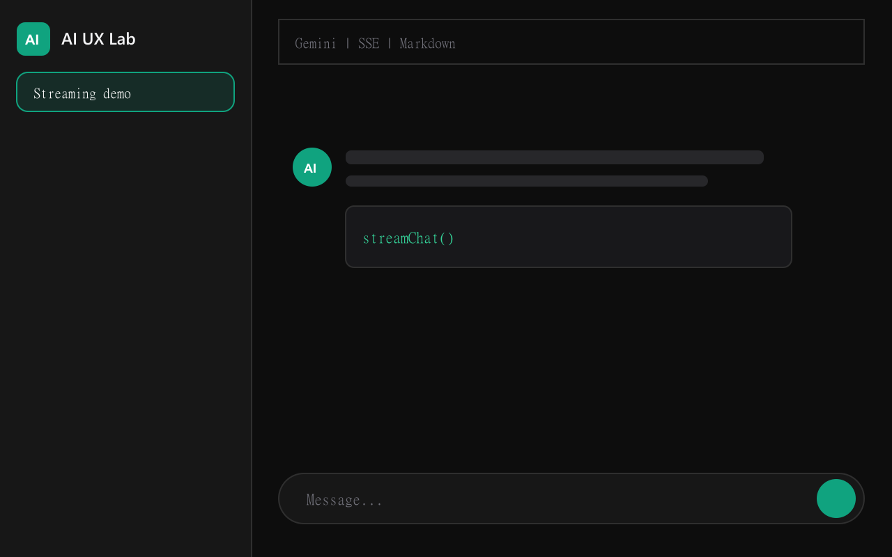
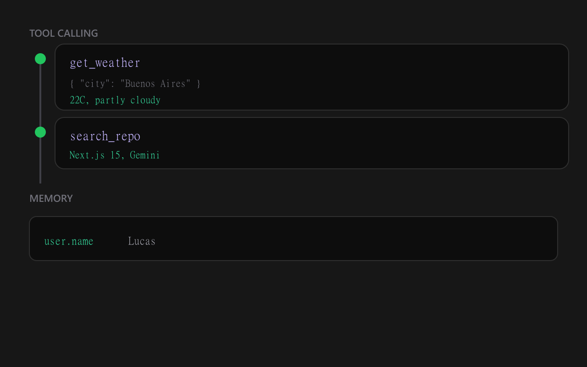
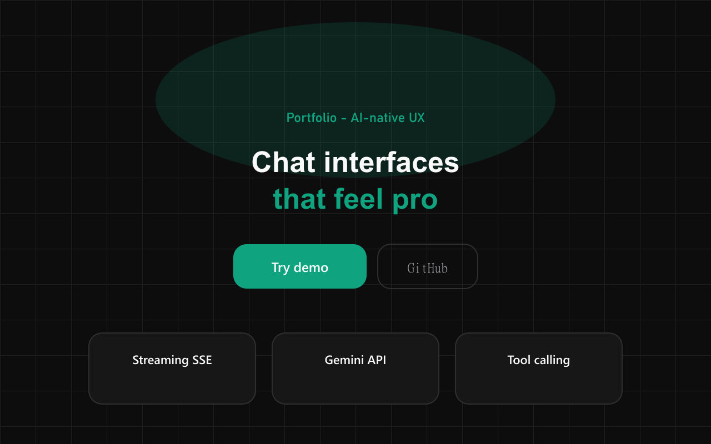

# AI UX Lab

**Portfolio-grade demo** of AI-native interfaces — the kind of project you show when asked *"how do you build UX with LLMs?"*

[](https://nextjs.org/)
[](https://www.typescriptlang.org/)
[](https://tailwindcss.com/)
[](https://vercel.com/)

## Live demo

> Replace with your URL after deploy:

`https://ai-ux-lab.vercel.app` · [Chat](/chat) · [GitHub](https://github.com/lucasfernandezdev15/ai-aux-lab)

## Screenshots

<p align="center">
  
  
  
</p>

<p align="center"><sub>Chat · Agents panel · Landing</sub></p>

> **Note:** GitHub does not render SVG in README reliably. PNGs are generated via `npm run screenshots`.

## Elevator pitch (30 seconds)

I built a **UX lab for LLM apps** on Next.js 15: SSE chat streaming, markdown rendering, tool-calling timeline, memory injected into the system prompt, multi-session sidebar, and Gemini / OpenAI / Anthropic support — plus a **demo mode** that runs **without an API key** for live interviews.

## What this project demonstrates

| Skill | Evidence in the repo |
|-------|----------------------|
| **Modern frontend** | App Router, client islands for chat |
| **Streaming / real-time** | Edge route handler, typed SSE (`token`, `tool`, `error`) |
| **AI integration** | Gemini, OpenAI SDK, Anthropic Messages API |
| **Product UX** | ChatGPT-like layout, mobile drawers, light/dark |
| **Architecture** | `lib/providers`, hooks, feature folders |
| **Deploy** | `vercel.json`, documented env, production build |

## Features

- **Chat streaming** — SSE from `/api/chat`
- **Markdown + syntax highlight** — GFM + Prism
- **Multi-provider** — Demo · Gemini · OpenAI · Anthropic
- **Memory panel** — Persisted context → `buildSystemPrompt()`
- **Tool calling UI** — Timeline with pending → done states
- **Multi-session** — Sidebar + `localStorage`
- **Prompt templates** — 4 shortcuts for interview demos
- **Landing page** — Hero, features, stack, CTA
- **Dark / light mode** — CSS variables + `ThemeProvider`

## Quick start

```bash
git clone https://github.com/lucasfernandezdev15/ai-aux-lab.git
cd ai-aux-lab
npm install
npm run dev
```

| Route | Description |
|-------|-------------|
| `/` | Portfolio landing |
| `/chat` | Main app |
| `/api/status` | Available providers (JSON) |

### Environment variables

```bash
cp .env.example .env.local
```

| Variable | Required | Description |
|----------|----------|-------------|
| `GEMINI_API_KEY` | No | Enables Gemini provider |
| `OPENAI_API_KEY` | No | Enables OpenAI provider |
| `ANTHROPIC_API_KEY` | No | Enables Anthropic provider |
| `NEXT_PUBLIC_SITE_URL` | No | URL for OG tags |
| `NEXT_PUBLIC_GITHUB_URL` | No | Repo link |

Without keys → **demo mode** with a simulated stream and sample tools.

### Regenerate README screenshots (PNG)

```bash
npm run screenshots
```

## Deploy on Vercel

1. Push to GitHub
2. [vercel.com/new](https://vercel.com/new) → Import repo
3. Add `GEMINI_API_KEY` (or other keys) under Environment Variables
4. Redeploy

```bash
npx vercel --prod
```

## Project structure

```
app/
  api/chat/route.ts      # SSE streaming (Edge)
  api/status/route.ts    # Available providers
  chat/page.tsx
  page.tsx               # Landing
components/
  chat/ landing/ panels/ sidebar/ ui/
hooks/
  useChat.ts useProvider.ts
lib/
  providers/             # gemini, openai, anthropic
  build-system-prompt.ts
public/screenshots/      # PNG for README (npm run screenshots)
```

## Interview talking points

1. **Why SSE over WebSockets?** One-way stream is enough for tokens; simpler behind CDNs.
2. **How is memory injected?** Panel items → `buildSystemPrompt()` → provider system message.
3. **How are providers handled?** Server resolves from env; client persists preference in `localStorage`.
4. **What would v3 add?** File RAG, auth, DB sync, Playwright e2e, optional Vercel AI SDK.

## Stack

Next.js 15 · TypeScript · Tailwind CSS · Edge Runtime · Gemini · OpenAI · Anthropic · react-markdown · Vercel

---

Update `lib/site.ts` with your name and links before applying to frontend / AI UX roles.
